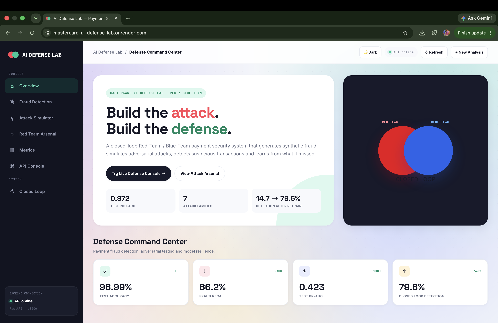

# 🛡️ Mastercard AI Defense Lab

### Red Team × Blue Team · AI-Powered Payment Fraud Defense

[](https://mastercard-ai-defense-lab.onrender.com/)
[](https://github.com/SunnyAgrwl05/mastercard-ai-defense-lab)
[](LICENSE)

**🚀 Live Demo:** https://mastercard-ai-defense-lab.onrender.com/
**💻 Repository:** https://github.com/SunnyAgrwl05/mastercard-ai-defense-lab

A closed-loop Red Team / Blue Team system for payment fraud. It attacks itself, finds its own weak spots, and gets better each round.



## How It Works

```text
┌─────────────────┐     ┌─────────────────┐     ┌─────────────────┐
│  Generate Data   │ ──▶ │  Blue Team       │ ──▶ │  Red Team        │
│  (transactions)  │     │  detects fraud   │     │  attacks it      │
└─────────────────┘     └─────────────────┘     └────────┬────────┘
                                                            │
                          ┌─────────────────┐              ▼
                          │  Model retrains  │ ◀── ┌─────────────────┐
                          │  and improves    │     │  Missed attacks  │
                          └────────┬────────┘     │  get logged      │
                                   │               └─────────────────┘
                                   └──────────────▶ Repeat
```

The core idea: don't just measure a model once — keep attacking it and let it learn from what it misses.

## Blue Team (Detection)

The Blue Team is the model that scores every transaction using signals like:

- Amount and spending baseline
- Merchant category and risk score
- Device type and location
- Transaction frequency and failed attempts
- Time of day

Three models are compared — **XGBoost**, **Random Forest**, and **Isolation Forest** — the best one is kept. Every score comes with a risk number, a fraud probability, and a plain-English reason.

## Red Team (Attacks)

The Red Team tries to fool the Blue Team using 7 attack styles:

| Attack | Idea |
|---|---|
| `amount_manipulation` | Stay under common amount limits |
| `velocity_attack` | Fire many transactions quickly |
| `merchant_switching` | Spread spend across merchants |
| `geo_evasion` | Keep location changes plausible |
| `account_takeover` | Change device, location, and amount at once |
| `low_and_slow` | Use many small transactions |
| `behavioral_mimicry` | Copy the victim's normal spending pattern |

Each attack has an intensity dial, from subtle to aggressive.

## Results

⚠️ All numbers below are from **synthetic research data**, not Mastercard production data.
**Dataset:** 160,265 transactions · 900 accounts · 80 days · 2% fraud rate

**Blue Team baseline (XGBoost):**

| Metric | Score |
|---|---|
| Accuracy | 97.7% |
| Precision | 47.1% |
| Recall | 94.7% |
| F1 | 62.9% |
| ROC-AUC | 0.995 |
| PR-AUC | 0.917 |

**Attack detection, before vs after retraining:**

| Attack | Before | After |
|---|---|---|
| geo_evasion | 0.7% | 5.3% |
| velocity_attack | 1.3% | 100.0% |
| low_and_slow | 2.0% | 98.0% |
| amount_manipulation | 4.7% | 42.7% |
| merchant_switching | 8.0% | 49.3% |
| behavioral_mimicry | 8.0% | 39.3% |
| account_takeover | 57.3% | 99.3% |
| **Overall** | **11.7%** | **62.0%** |

`geo_evasion` stays the hardest to catch — an honest gap, not hidden.
**The trade-off:** catching more attacks flags more real transactions too.

| Metric | Before | After |
|---|---|---|
| Precision | 0.471 | 0.315 |
| Recall | 0.947 | 0.956 |
| F1 | 0.629 | 0.474 |

A real deployment would need threshold tuning and human review to manage this.

## The Dashboard

The live site (`web/index.html`) lets you:

- Score a transaction and see its risk breakdown
- Launch an attack and watch it get caught (or not)
- Browse all 7 attack types and their success rates
- See model charts — ROC curve, detection rates, feature importance
- Check live API health

## API

| Endpoint | Method | Does |
|---|---|---|
| `/health` | GET | API and model status |
| `/predict` | POST | Score a transaction |
| `/simulate-attack` | POST | Run one attack, get the result |
| `/red-team` | POST | Run a batch of attacks |
| `/metrics` | GET | Get evaluation numbers |

Docs at `http://localhost:8000/docs` when running locally.

## Project Structure

```text
mastercard-ai-defense-lab/
├── api/main.py
├── models/
├── notebooks/Mastercard_AI_Defense_Lab_2026.ipynb
├── outputs/
├── src/
│   ├── data_generator.py
│   ├── blue_team.py
│   ├── red_team.py
│   ├── adversarial_training.py
│   ├── evaluation.py
│   ├── explainability.py
│   └── demo.py
├── web/index.html
├── Dockerfile
├── requirements.txt
└── README.md
```

## Run It Locally

```bash
git clone https://github.com/SunnyAgrwl05/mastercard-ai-defense-lab.git
cd mastercard-ai-defense-lab
python3 -m venv venv
source venv/bin/activate
pip install -r requirements.txt
python3 -m uvicorn api.main:app --host 0.0.0.0 --port 8000
```

Open `http://localhost:8000`.

**Docker:**

```bash
docker build -t mastercard-ai-defense-lab .
docker run -p 8000:8000 mastercard-ai-defense-lab
```

## Notebook

`notebooks/Mastercard_AI_Defense_Lab_2026.ipynb` walks through the whole pipeline — data, training, attacks, retraining, evaluation. Works locally or on Kaggle.

## Data & Privacy

All data here is synthetic. This project has no real Mastercard cardholder data, doesn't touch any production payment system, and uses demo thresholds only.

## Known Limitations

- Data is synthetic, not real payment history
- Attacks are simulated, not observed in the wild
- Geo evasion is still hard to catch
- Retraining trades some precision for better attack coverage
- No real payment-network integration

## What's Next

- Real-time streaming detection
- Graph-based fraud detection
- Device fingerprinting and IP reputation
- Human review queue
- Model drift monitoring

## Tech Stack

**ML:** Python · XGBoost · Scikit-learn · SHAP · Pandas · NumPy
**Backend:** FastAPI · Uvicorn
**Frontend:** HTML · CSS · JavaScript
**Infra:** Docker · Render · GitHub

## License

MIT License — see [LICENSE](LICENSE).

## Disclaimer

This is an independent hackathon prototype, not an official Mastercard product. All data is synthetic.

---

<div align="center">

🚀 [Live Demo](https://mastercard-ai-defense-lab.onrender.com/) · 💻 [GitHub](https://github.com/SunnyAgrwl05/mastercard-ai-defense-lab)

**Dev by Sunny — AI/ML Engineer & SDE**

</div>